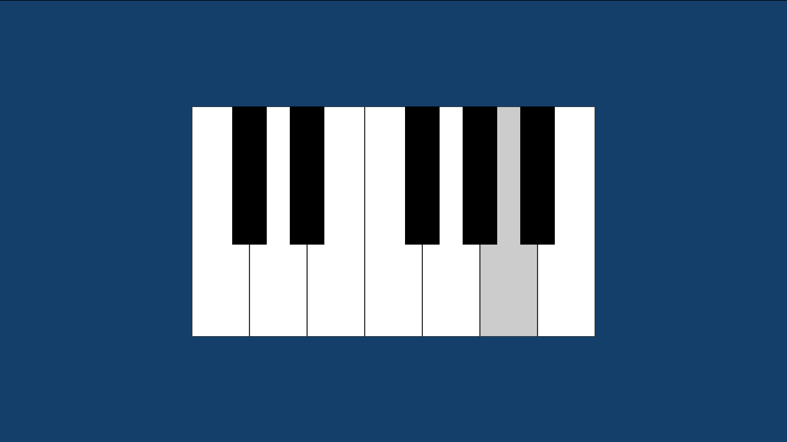

# Javascript Piano

This is a simple piano made on `Javascript`.

You can use your mouse to interact or your computer keys.
The keys are:

    BLACK KEYS = ['s', 'd', 'g', 'h', 'j']
    WHITE KEYS = ['z', 'x', 'c', 'v', 'b', 'n', 'm']

## Preview

- 1  
    

- 2  
    